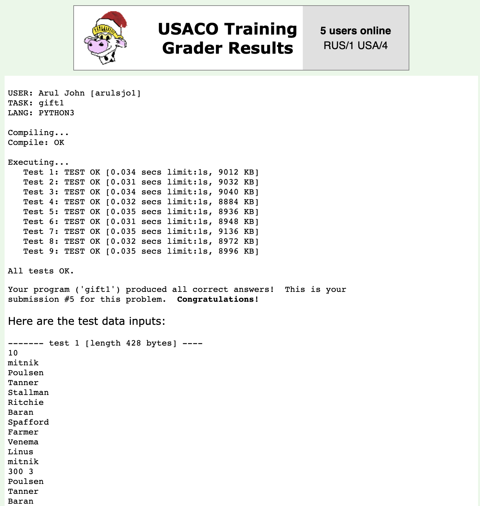

# USACO Python code

This repo contains my USACO code solutions in Python.

## Task 'gift1': Greedy Gift Givers

A group of NP (2 ≤ NP ≤ 10) uniquely named friends has decided to exchange gifts of money. Each of these friends might or might not give some money to some or all of the other friends (although some might be cheap and give to no one). Likewise, each friend might or might not receive money from any or all of the other friends. Your goal is to deduce how much more money each person receives than they give.

My Python solution for this is `gift1.py`

The sample input file is `gift1.in`.

Download both `gift1.py` and `gift1.in` to the same directory, and run it:

`python gift1.py`

The program will create `gift1.out`.

To submit this code, click on **Choose File**, select the file and click on the button **Send it in!**.

The resulting page should show something like this:

